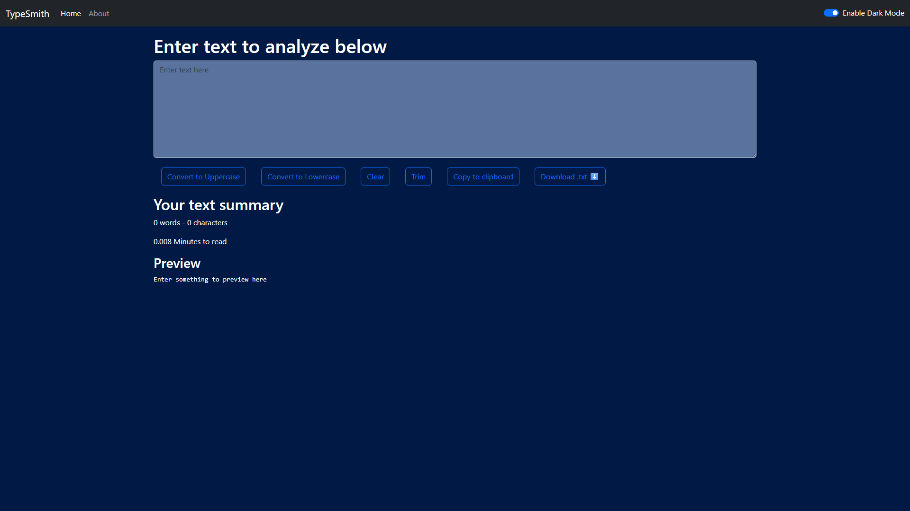
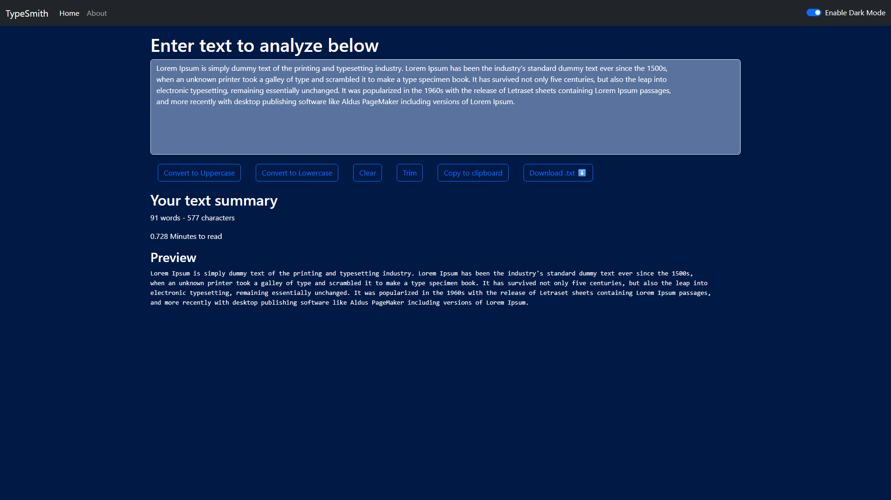

# 🖋️ Typesmith — React Text Toolkit

An interactive and customizable React-based web application that empowers users to transform and manage text effortlessly.  
Offers a wide range of tools including uppercase/lowercase conversion, trimming, clearing, copying, downloading, previewing, and reading time estimation.  
Built with a flexible custom theme engine for a fully personalized UI/UX. Perfect for writers, coders, students, and professionals needing a reliable text utility tool.

---

## ✨ Features

- Convert text to **UPPERCASE**, **lowercase**, **Title Case**, or **Sentence case**
- Trim spaces, remove extra lines, and collapse whitespace
- Clear text, copy to clipboard, or download as `.txt`
- Live preview with word/character counts and reading time estimation
- Customizable theme engine for personalized UI/UX
- Responsive and accessible design for all devices

---

## 🖼️ Screenshots

  
*Editor interface for text input and transformation tools.*

  
*Real time stats displayed on filling input*

---

## 🚀 Usage

1. **Paste or type** your text into the editor area.
2. Choose the desired **transformation tool** from the toolbar:
   - Uppercase / lowercase / title case / sentence case
   - Trim, clear, copy, or download
3. View **real-time updates** in the preview area with stats.
4. Optionally, **switch themes** for a customized appearance.
